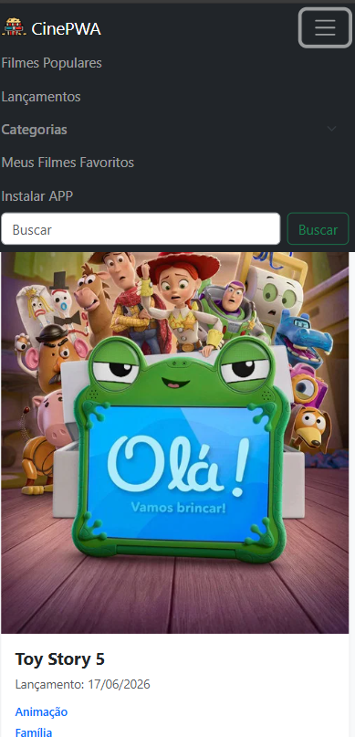
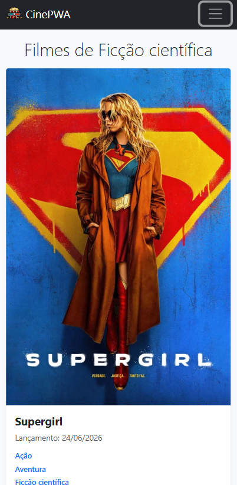
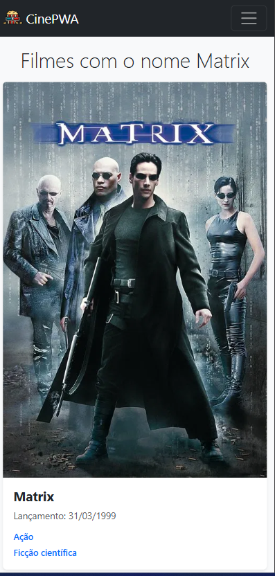

#  CinePWA - Catálogo de Filmes 

O **CinePWA** é um aplicativo de catálogo de filmes desenvolvido com conceitos de **Single Page Application (SPA)** e **Progressive Web App (PWA)**. O projeto consome a API pública do **The Movie Database (TMDB)** para apresentar informações em tempo real sobre filmes em alta, lançamentos, notas de avaliação e detalhes de elenco.

Este projeto foi desenvolvido como parte **prática** do curso Técnico em Desenvolvimento de Sistemas (IFSC) para a disciplina de Dispositivos Móveis.

---

## 📸 Demonstração do Projeto

Abaixo você pode conferir algumas das principais interfaces da aplicação:

  
  
  

---

## 🚀 Funcionalidades

* **Lista de Filmes Populares e Lançamentos:** Exibição dinâmica dos filmes mais em alta no momento.
* **Busca Dinâmica:** Pesquisa de filmes por nome de forma rápida e intuitiva.
* **Filtro por Categorias:** Menu suspenso para explorar filmes por gêneros específicos (Ação, Comédia, Ficção Científica, etc.).
* **Detalhes do Filme:** Ao clicar num cartão, a aplicação carrega a sinopse completa, data de lançamento, avaliação (nota e quantidade de votos) e os principais atores do elenco.
* **Meus Favoritos:** O usuário pode favoritar filmes na tela de detalhes. Esses dados são salvos localmente (via LocalStorage), permitindo gerenciar a lista e acessá-la rapidamente através do menu de navegação.
* **Navegação SPA (Single Page Application):** Transições de tela fluidas e instantâneas, manipulando o DOM sem recarregar a página do navegador.
* **Progressive Web App (PWA):**
  * Suporte para instalação direta na tela inicial do celular ou desktop.
  * Funcionalidade offline básica garantida pelo uso de *Service Workers* e *Manifest*.
* **Design Responsivo (Mobile First):** Layout adaptável perfeitamente a celulares, tablets e monitores.

---

## 💻 Tecnologias e Bibliotecas Utilizadas

O projeto foi construído utilizando as seguintes tecnologias:

* **HTML5 e CSS3:** Estruturação semântica e estilização base.
* **JavaScript (Vanilla JS):** Lógica da aplicação, manipulação de DOM, Promises, funções assíncronas (`async/await`) e gerenciamento de estado via `LocalStorage`.
* **Bootstrap 5:** Framework CSS utilizado para o sistema de grid responsivo, cards e componentes de interface (como o menu *offcanvas/collapse*).
* **Axios:** Biblioteca baseada em Promises utilizada para realizar as requisições HTTP (GET) à API externa.
* **SweetAlert2:** Biblioteca utilizada para criar alertas visuais bonitos e interativos (feedback ao adicionar ou remover favoritos).
* **TMDB API:** Fonte de dados RESTful que fornece todo o catálogo de filmes, imagens e créditos de elenco.
